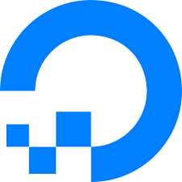
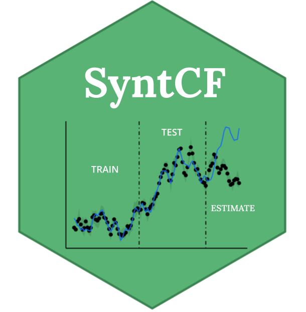

# Hello, folks! 

My name is Ahmed and I am a Data Scientist, Quantitative Researcher and Program Evaluator. 
I have a PhD in Applied Machine Learning and Econometrics and I have been working on data for over 10 years in both the academic and private sectors. 
I am also the creator and maintainer of the open-source R library [syntCF](https://github.com/athammad/syntCF), which offers a collection of tools to perform rigorous causal inference with Machine Learning and time-series data.

**My fields of interest:**
- [ ] Program and Policy Evaluation
- [ ] Econometrics
- [ ] Machine Learning
- [ ] Time Series
- [ ] Environmental Analysis
- [ ] Sensor & Satellite Data

**Get in Touch with me:**
[ LinkedIn](https://www.linkedin.com/in/ahmedt-h/)
 

## ✍Papers & Blog

You can find a list of my publications on [Google scholar](https://scholar.google.com/citations?user=uE11zZAAAAAJ&hl=en). Apart from coding and writing, I also maintain a blog - you can find my articles on my website [Decatab.com](https://www.decatab.com).

## Languages and Tools

 
   

---

<!--**athammad/athammad** is a ✨ _special_ ✨ repository because its `README.md` (this file) appears on your GitHub profile.

Here are some ideas to get you started:

- 🔭 I’m currently working on ...
- 🌱 I’m currently learning ...
- 👯 I’m looking to collaborate on ...
- 🤔 I’m looking for help with ...
- 💬 Ask me about ...
- 📫 How to reach me: ...
- 😄 Pronouns: ...
- ⚡ Fun fact: ...
-->
